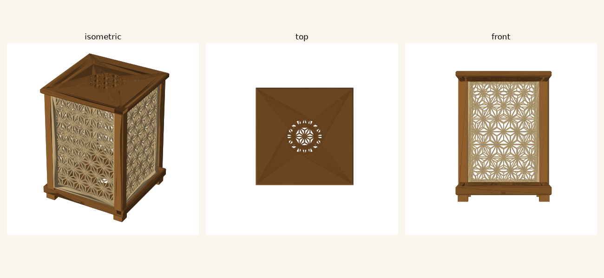
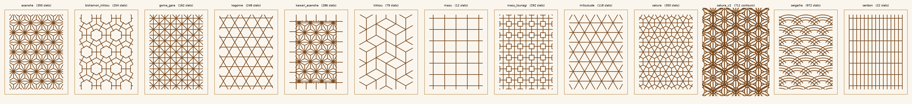

# Kumiko Lamp — parametric, print-ready STL set

A parametric lantern for an E27 or E14 LED bulb, available in two styles. **Classic** is
the original square four-panel lamp; **Modern** is a two-part cylindrical lamp with a
threaded patterned shade. Classic remains the default, and its geometry and stock STLs are
unchanged.

The Classic parts print with **no supports** and assemble with sliding
mortise-and-groove joints — no glue and, as it ships, no fasteners of any kind. Four M3
screws are an option, not a requirement; see *Screwing the Classic cap down*. The stock
Classic is **190 × 190 × 236 mm** on its four legs. The stock Modern pairs a
**Ø100 shade and Ø100 base** at 298 mm assembled height. Both are designed for the
256 mm bed of the A1 / P1S / X1C.



## Two ways to build it

**[`web/index.html`](web/index.html) — the configurator.** Open it in a browser, choose
**Classic** or **Modern** under *Lantern*, adjust the dimensions, pattern, joints and
lamp-holder sizing, turn the lamp in 3D, and download the STLs individually or as a zip.
Each style remembers its own settings while you switch between them. No install, no
network, one self-contained file. It re-solves the joinery live and refuses to export a
lamp that will not go together. The new controls and messages are available in both
English and Thai.

**`kumiko_lamp.py` — the generator.** Same selected style, same numbers, built with real
CSG so every part is a strictly manifold shell. Use this if your slicer is fussy, or for
the pre-generated set in `stl/`.

The two agree: for identical settings the structural parts, adapter ring and downloaded
Modern shade come out of the browser watertight and closely volume-matched to the Python
parts. Classic's live-built lattices use a lighter representation — see
[Manifold-ness](#manifold-ness) below.

## Lantern styles

**Classic** is the existing square lamp: four interchangeable panels slide between four
posts, with separate feet, a grooved base and a removable top cap. It supports all eleven
offered patterns, optional diffusers, two-piece posts, cap screws, finials and reusable
snap locks.

**Modern** is a hollow cylindrical base and a removable cylindrical shade. The reference
preset uses a 100 mm shade diameter, a 100 mm base diameter, a 218 mm shade and a 90 mm
base. In the configurator, **Shade diameter** and **Base diameter** begin linked: moving
the shade-diameter control moves both until you edit Base diameter directly. That first
base edit unlinks them, allowing a broader body while later shade changes keep
the chosen base size. Set Base diameter equal to Shade diameter to relink them; this link
state is remembered when you switch between Classic and Modern. The shade overlaps the
base's threaded neck by 10 mm, producing the 298 mm assembled height. Its upper and lower
rings are each 10 mm high, with the selected Kumiko lattice wrapped continuously around the
cylinder between them. The base carries the male thread and the shade's lower ring carries
the matching female thread. The threaded neck follows the shade diameter; the base body
uses its independently selected diameter. Immediately below the neck, the body contracts
through a 45-degree transition; after the base is inverted for printing, that transition
expands without a horizontal cantilever.

Modern supports the eleven Kumiko patterns only. The three Lai Thai compositions are
panel-sized artwork and cannot be wrapped periodically, so Modern rejects them instead of
substituting another design. Modern has no generated diffuser; add a paper or vellum liner
inside the shade if you want softer light.

Modern **Seigaiha** is the exception to the normal swept-slat construction. It preserves
the four signed contours from `reference/seigaiha-blue.svg` as a filled 2 × grid by
1 × grid repeat: coloured regions print and white regions remain light openings. At the
reference 1.6 mm material setting it matches the source; Material width offsets that
region thinner or thicker. A fit guard rejects any rounded opening whose estimated roof
bridge exceeds 9 mm, and the repeat-boundary tips are normalized so every row welds.
Classic Seigaiha remains the original three-arc line pattern.

---

## Print list

### Classic (default)

| STL | Qty | Size (mm) | Orientation on the plate |
|---|---|---|---|
| `panel_asanoha.stl` | **4** | 155.7 × 210 × 4 | Flat, **lattice face down**. As exported — drop it on the plate. |
| `post.stl` | **4** | 18 × 18 × 210 | Standing upright, as exported. Use a brim. |
| `base.stl` | **1** | 190 × 190 × 16 | Flat, as exported. Underside is dead flat. |
| `top_cap.stl` | **1** | 190 × 190 × 10 | Flat, as exported — **already flipped** into print orientation. |
| `leg.stl` | **4** | 20 × 20 × 20 | Standing on its foot, as exported. Tenon points up. |
| `socket_adapter_ring.stl` | **1** | Ø49.6 × 4 | Flat. See *E27 / E14 holder* below. |
| `diffuser_plate.stl` | 0 or **4** | 155.7 × 210 × 1.2 | Flat, as exported. Only if you want a printed diffuser — see *Classic diffuser* below. |
| `finial.stl` | 0 or **4** | 20 × 20 × 10 | Screw-head finial cap, standing on its head. Skirt points up. Only with the cap screws. |

Swap in `panel_kikkou.stl`, `panel_mitsukude.stl`, `panel_kawari_asanoha.stl`,
`panel_kagome.stl`, `panel_masu.stl`, `panel_masu_tsunagi.stl`, `panel_senbon.stl`,
`panel_goma_gara.stl`,
`panel_bishamon_kikkou.stl` or `panel_seigaiha.stl` for a different motif — all
eleven Classic panels are dimensionally identical
and interchangeable. Roughly in order of open area: masu and kikkou are
the airiest, asanoha and goma-gara the densest.

### Modern

| STL | Qty | Reference size | Orientation on the plate |
|---|---|---|---|
| `modern_shade_asanoha.stl` | **1** | Ø100 × 218 mm | Upright, as exported. Use a brim if your slicer or material needs it. |
| `modern_base.stl` | **1** | Ø100 × 90 mm nominal | **Inverted, as exported.** The mounting deck starts on the bed and the neck reaches the body through a 45-degree transition. |
| `socket_adapter_ring.stl` | **1** | Ø49.6 × 4 mm | Flat. The same E27/E14 adapter used by Classic. |

Replace `asanoha` in the shade filename with `kikkou`, `mitsukude`, `kawari_asanoha`,
`kagome`, `masu`, `masu_tsunagi`, `senbon`, `goma_gara`, `bishamon_kikkou` or
`seigaiha`. A reference-size `modern_base.stl` and all eleven
`modern_shade_<pattern>.stl` files are checked into `stl/`; custom sizes are generated or
downloaded on demand. The supplied reference STLs used to establish the proportions are
not copied into the repository.
The configurator's part table, individual filenames, ZIP name and ZIP contents follow the
selected style; a Modern download does not include Classic-only parts. Individual filenames
stay stable at `modern_base.stl`, `modern_shade_<pattern>.stl` and
`socket_adapter_ring.stl`. A linked Ø100 pair downloads as
`kumiko-lamp-modern-100mm-<pattern>.zip`; unequal diameters are explicit in names such as
`kumiko-lamp-modern-shade100mm-base140mm-<pattern>.zip`.

**Seigaiha** (青海波, "blue sea wave") is the odd one among the kumiko: a field of curves
rather than a straight lattice. Classic uses rows of overlapping three-arc fans, each row
offset half a fan from the one below. Modern instead uses the imported filled repeat
described above, with its wave ends joined for one support-free cylindrical shell.

**Masu** (枡格子) and **Senbon** (千本格子) are the plain ones: a bare square grid, and
close-set vertical bars crossed by a rail every third bar. Senbon's bars run at a third of
the pattern pitch, so the stock 28 mm gives a 9.3 mm spacing — fine enough to earn the
"thousand sticks" of its name. At 12 and 22 slats they are the two cheapest panels to
print, and Masu is the most open of the eleven.

## The Lai Thai family is currently disabled

Three Thai compositions — **Kranok Kan Khot**, **Dok Phut Tan** and **Thai Rosette** — are
still in the repo and still build, but are **not offered**: they are absent from the
configurator's pattern picker, from `--pattern`, and from `--all`. Their three
`panel_*.stl` files and preview SVGs remain checked in, and stop being regenerated.

To bring them back, set **both** flags to true and regenerate:

```
kumiko_lamp.py   LAITHAI_ENABLED = True
web/index.html   var LAITHAI_ENABLED = true;
```

They are switched off rather than deleted because `thai_rosette` is the only *region*
pattern, so removing the family would take `PATTERN_REGIONS`, `extrude_region` and the
whole imported-artwork extension point with it. The descriptions below are kept for that
reason.

**Kranok Kan Khot**
(กระหนกก้านขด) is a different kind of thing: not a repeating lattice but **one composition filling the
whole panel** — a diamond medallion of Thai flame work, with a column of nested pointed
lenses on the axis, a spike to the apex, and volutes at the waist throwing flames out along
the diamond's edges. It is bilaterally symmetric, so only the right half is authored and
mirrored. All four panels carry the same artwork.

Two consequences worth knowing. Because there is no tile, `--grid` has no pitch to set for
this pattern and drives curve tessellation instead. And the top cap keeps a kumiko grille
when it is selected: scaled into the 70 mm vent the composition is just a shrunken copy of
the panel, ~19k triangles in a hole you can barely see into.

**Dok Phut Tan** (ดอกพุดตาน) is a broad, layered flower derived from the peony-like motif
used in early-Rattanakosin Thai ornament. Three scalloped petal tiers grow from a common
heart, while four scrolling stems, paired leaves and forked perimeter braces tie it into
the side, top and bottom rails. Like Kranok,
it is one panel-sized composition rather than a repeating tile, and the cap uses the
Kikkou fallback grille.

**Thai Rosette** is different again: it is not drawn in code at all but **imported**
from `reference/laithai.svg`. Where every other pattern is line work swept into
fixed 1.6 mm slats, this one is a *filled region* — an outer contour plus 13 holes —
so its stroke thickness varies the way the original artwork does. It is fitted to the
panel width undistorted, which leaves a plain band top and bottom, and a thin border
with four diagonal ties and four centre spokes holds it together: on its own the
artwork is two loose pieces and neither reaches the frame.

To change it, edit the SVG and re-run `python tools/svg2pattern.py reference/laithai.svg`,
then paste the table into both implementations — the browser core has no file access,
so the contours have to be baked in.

`post_lower.stl` + `post_upper.stl` are an **optional** two-piece post joined by an 8 mm
pin (117 mm and 105 mm tall). Use them only if you would rather not print a 210 mm tall
slender tower, or you are on a 180 mm-Z machine. Print 4 of each *instead of* `post.stl`.

`assembly_preview.stl` is **not for printing** — a generator run writes the selected style
with its print parts placed upright for checking fit in a viewer. The checked-in stock
preview remains Classic; generate Modern into a separate `--out` directory when you want
its preview.



## Slicer settings (Bambu Studio)

These are a safe starting point for either style; keep the exported orientations listed
above.

| | |
|---|---|
| Nozzle / layer | 0.4 mm / 0.2 mm — use 0.16 mm on the panels for a crisper lattice |
| Wall loops | **4** — slats are 1.6 mm wide, exactly 4 × 0.4, so they come out fully solid with no infill inside them |
| Infill | 15 % gyroid (only solid frames, posts, bases and the Classic cap ever see it) |
| Supports | **Off** for every part |
| Brim | 5 mm on the posts and panels; optional elsewhere |

Rough Classic filament: one full set is 1323 cm³ of solid volume (1641 g if it were
100 % dense).
The panels and posts are effectively solid; the base and cap are slabs that infill
hollows out considerably. At 15 % infill expect very roughly **700–800 g** — your
slicer's estimate is the one to trust.

## Assembly

### Classic

1. Press the four **legs** into the blind sockets in the underside of the **base**.
2. Drop the four **posts** into the corner sockets on top of the base.
3. Slide each **panel** down between two posts — the grooves in the posts catch its
   side edges, and its bottom edge lands in the groove in the base. Lattice faces out.
4. Fit the **top cap** over the four post tops and the four panel top edges.

It is a friction fit throughout, so the cap lifts off to change the bulb. Fit the optional
cap screws and it does not: four finials come off and four screws come out first. Joint
clearances are 0.4 mm on the grooves, 0.3 mm on panel width and 0.35 mm on the leg
tenons. If your printer runs tight and the panels bind, raise `slot_clear` and reprint
the posts — that is the one part you would need to redo.

### Modern

1. Fit the selected E27/E14 holder and `socket_adapter_ring.stl` to the mounting deck,
   route its cord through the bottom outlet, and complete the wiring before fitting the
   shade.
2. Turn `modern_base.stl` upright after printing; it is exported upside-down only to keep
   the mounting deck and male thread support-free.
3. Add an optional paper liner inside the shade, keeping it clear of the bulb and vents.
4. Lower the shade over the base neck and screw it down through the full 10 mm engagement.
   Stop when the full engagement is reached; do not force or overtighten the printed thread.

Unscrew the shade to change the bulb. The thread uses a 2 mm pitch, 0.8 mm radial depth and
45° printable flanks. Its **radial** clearance slider spans 0.10 to 0.80 mm; the default
0.30 mm is a starting point, not a universal fit:

```bash
python3 kumiko_lamp.py --style modern --thread-clearance 0.20  # tighter
python3 kumiko_lamp.py --style modern --thread-clearance 0.30  # default
python3 kumiko_lamp.py --style modern --thread-clearance 0.60  # looser
```

Start at 0.30 mm, then tune for the material, layer height and dimensional accuracy of your
printer. The generator rejects settings that leave unsafe thread walls or mounting-deck
thickness. A wider independent base does not change the thread fit: its neck still matches
the shade, while the lower body and its support-free 45° transition expand to the selected
base diameter. Check that diameter against both printer-bed axes.

## Classic legs

The legs are separate parts rather than moulded onto the base, and that is deliberate:
hung off the underside they would turn the whole 190 mm slab into an unsupported ceiling,
and every part here prints without supports. A 10 mm square tenon plugs into a blind
socket under each corner post, so the load runs straight down post → base → leg. Square
rather than a round pin, so a leg cannot rotate out of line with the base edges.

They also lift the base 12 mm off the table, which gives the cord somewhere to go.

### Reusable snap locks

The feet are a clearance fit by default. Add a light reusable snap detent with:

```bash
python3 kumiko_lamp.py --snap-lock       # recommended 0.2 mm engagement
python3 kumiko_lamp.py --snap-lock 0.1   # lighter fit
python3 kumiko_lamp.py --snap-lock 0     # off (the default)
```

The same setting applies to the four feet and the four screw-head finial caps, so a
screwed lamp has all eight matching corner pieces retained. Two small tabs flex into
matching hidden recesses; the feet have a hollow tenon and the finials flex around their
screw cavity. Start at 0.2 mm and tune the **Snap engagement** slider for your printer and
material. PETG is preferred for repeated removal; PLA snaps are more brittle. No snap fit
has been test-printed yet.

## Screwing the Classic cap down

The cap is a friction fit and needs nothing else. If you would rather it could not be
lifted off — a lamp that travels, or one somewhere a cat can reach — each post top can
take a **heat-set threaded insert**, with an M3 screw down through the cap into it and a
finial over each screw to hide the head. The finials echo the four legs: four feet below,
four caps above.

```bash
python3 kumiko_lamp.py --post-insert 4.0    # M3, the working value
python3 kumiko_lamp.py --post-insert 0      # none (the default)
```

In the configurator it is the **Insert hole** slider under *Cap screws*; `0` means none.

**You will need:** 4 × M3 heat-set insert, OD 4.6 × 5.7 mm long (the common
Ruthex/CNC-Kitchen size, 4.0 mm pilot) · 4 × M3 × 8 socket cap screw · a 2.5 mm hex key ·
a soldering iron to set the inserts.

Set the inserts into the post tops before assembly, build as usual, then drop a screw
through each corner of the cap and nip it up — **snug, not tight**. The screw pulls the cap
down until the post bottoms out against it, so there is nothing to gain from more torque
and an insert to strip if you keep going. The finials are a light press fit by default or
a removable detent with `--snap-lock`; leave them unglued or you will never get the bulb
out.

**Ø4.0 is the largest hole an 18 mm post will really take.** The panel grooves reach in to
within 3 mm of the post axis, so a 4 mm hole leaves a 1 mm wall — and that wall is where
the insert's melt wants to bulge, into the groove face. `check_fits` refuses anything past
two extrusions of wall, but if you want M4, widen the post to 20 mm first.

## Classic diffuser

The back of every panel is pocketed 0.6 mm deep, and the pocket runs out through the top
edge. Slide a sheet of **shoji paper or vellum** down into it before you fit the cap.
The pocket holds it on the other three sides; the top is hidden inside the cap groove.
Cut the sheet to **139.7 × 202 mm**. Traditionally this is glued — a little PVA around
the edge is plenty, but friction alone works.

Leave it out entirely if you want hard-edged shadows thrown on the wall instead.

### Or print the diffuser

Instead of paper, each groove can take a **clear printed plate** that sits behind the
lattice — same job, no cutting or gluing, and it will not yellow.

```bash
python3 kumiko_lamp.py --diffuser-plate 1.2     # the working thickness
python3 kumiko_lamp.py --diffuser-plate 0       # none (the default)
```

In the configurator it is the **Diffuser plate** slider under *Panel*; `0` means none.
A glazed side renders translucent so you can see the plate through the lattice.

`diffuser_plate.stl` shares the panel's 155.7 × 210 footprint, so the groove holds it on
all four edges. Print it in **clear PETG or PLA** — 1.2 mm is six layers, and it prints
flat with no supports.

The groove widens to take both, `panel + plate + clearance`, and **that is what caps the
plate at 1.6 mm**: the post's two grooves are notches cut 6 mm deep into an 18 mm post,
and once each is half as wide as the 6 mm they leave, the two meet and the post's corner
falls off. `check_fits` refuses anything that reaches it. Nothing else moves — panel
width, the patterns and every other part are identical glazed or not.

You can still use paper as well; the 0.6 mm rebate is untouched.

## E27 / E14 holder

Both styles reuse the same holder presets and stable `socket_adapter_ring.stl` filename.
The Classic base has a Ø40 mm through-bore, a Ø50 × 4 mm counterbore around it, and an
enclosed cord tunnel through one side wall. The Modern base puts the same bore and
counterbore in its circular mounting deck and routes the cord through the bottom outlet.

`socket_adapter_ring.stl` seats in the counterbore and is what your holder clamps
against. The E27 preset keeps the original Ø26.5 mm bore; the E14 preset uses a Ø27 mm
bore for the common threaded-sleeve style:

```bash
python3 kumiko_lamp.py --holder e14
```

E14 and E27 name the bulb interface, not the holder's mounting neck, and actual hardware
varies. For example, [one commercial E14 sleeve is specified at Ø27.5 mm](https://produkte.kopp.eu/en/id/212501049/). Measure yours
and override the preset when needed:

```bash
python3 kumiko_lamp.py --holder e14 --socket-neck 27.5
```

It is a 5 g, few-minute print, which is exactly why the fit lives in a separate part
rather than in either base. Select the same holder preset independently in Classic or
Modern; a subsequent manual neck adjustment keeps the selected E27/E14 identity.
The configurator's CLI echo includes `--holder` and also `--socket-neck` when you move the
neck away from that holder's preset.

## Heat — please read

**LED bulb only, 9 W maximum.** A filament or halogen bulb will soften and deform this
lamp. PLA starts to go at around 60 °C.

Ventilation is built in. Classic has 1640 mm² of open area through the cap grille and a
16-slot ring in the base under the bulb; Modern adapts that vent layout to its circular
mounting deck and vents through the open lattice above. Both are sized for a cool-running
LED and nothing more.

I would **print either base, the Classic top cap and the Modern shade in PETG** — they are
the parts nearest the bulb, and PETG holds up to roughly 80 °C. PLA is fine for the Classic
panels and posts. All-PETG is fine too.

Mains wiring is your responsibility. If you are not confident terminating a lamp holder,
use a ready-made corded E27 or E14 socket rather than making one up.

## Customising

Every dimension lives in the `Params` dataclass at the top of `kumiko_lamp.py`. The ones
worth reaching for are on the command line:

```bash
python3 kumiko_lamp.py --all                    # Classic: all 11 offered patterns + both post styles
python3 kumiko_lamp.py --style classic          # explicit form of the unchanged default
python3 kumiko_lamp.py --pattern kikkou         # one Classic pattern's part set
python3 kumiko_lamp.py --grid 20                # finer lattice
python3 kumiko_lamp.py --size 150 --height 170  # smaller lamp (fits an A1 mini)
python3 kumiko_lamp.py --slat 2.0               # chunkier slats (keep it a multiple of 0.4)
python3 kumiko_lamp.py --panel-thickness 5      # thicker Classic panels
python3 kumiko_lamp.py --edge-chamfer 0         # square off the base and cap edges
python3 kumiko_lamp.py --diffuser-plate 1.2     # printed diffuser behind each lattice

python3 kumiko_lamp.py --style modern           # Ø100 × 218 shade + 90 mm base
python3 kumiko_lamp.py --style modern --all     # 11 shades + base/ring + assembly preview
python3 kumiko_lamp.py --style modern --size 120 --height 240
python3 kumiko_lamp.py --style modern --modern-base-diameter 140  # wider body, Ø100 shade
python3 kumiko_lamp.py --style modern --panel-thickness 5  # deeper radial lattice
python3 kumiko_lamp.py --style modern --modern-base-height 100
python3 kumiko_lamp.py --style modern --thread-clearance 0.35
python3 kumiko_lamp.py --style modern --holder e14
```

For Modern, `--size` is the **shade** diameter and `--height` is the shade height.
The base diameter follows `--size` when `--modern-base-diameter` is omitted; supplying the
new flag makes the body independent while the threaded neck remains matched to the shade.
`--panel-thickness` controls Classic panel thickness or Modern radial lattice depth; its
default is 4 mm in either style. `--grid` and `--slat` keep their pattern-pitch and
slat-width meanings. `--style` defaults to `classic`, so existing commands and generated
Classic STLs remain unchanged.

The Classic base and cap carry a 2 mm 45° chamfer on all four perimeter edges. It is
capped at the cord tunnel floor (2 mm by default — raise `cable_floor` for a deeper bevel)
and, at 4.8 mm, by the wall left around the post sockets; `check_fits` refuses anything
past either.

Adding a pattern means writing one `f(w, h, s) -> [segments]` function and registering it
in `PATTERNS`. Two rules, both learned the hard way:

- Periodic patterns must **overshoot** the opening they are given; the caller clips.
- Anything that lands on another slat must **overlap** it, never merely touch. Two slats
  that abut along a single tangent edge union into geometry that does not survive the
  float32 STL round-trip, and the part comes back with unpaired edges.

```bash
pip install -r requirements.txt
python3 kumiko_lamp.py --all
python3 render_preview.py     # optional, needs matplotlib
```

On Windows the interpreter is normally `python`, not `python3` — substitute it throughout.

## Manifold-ness

The browser has no CSG engine, so `web/index.html` builds geometry a different way — a
winding-rule slab decomposition, with T-junctions welded afterwards. The result:

| Part | From the browser |
|---|---|
| `base`, `post`, `leg`, `socket_adapter_ring`, `modern_base` | Single **watertight** shell, volume matched to the Python part |
| Downloaded `modern_shade_*` | Single **watertight** periodic cell-complex shell, including the female thread |
| `panel_*`, `top_cap` and lightweight line-pattern Modern previews | Closed lattice solids, overlapping where slats cross |

The Modern Seigaiha live preview uses the filled periodic cell shell too, at a coarser
responsive grid; its strict download uses the normal sub-millimetre export grid.

There are **no open edges** in the lightweight lattices — every edge is shared by an even
number of faces. But at their crossings the shared ones sit on four faces rather than two,
so a strict manifold check calls them non-manifold and your slicer may offer to repair
them. Every slicer unions overlapping closed solids correctly, so Classic parts print as
drawn.

That is a deliberate live-preview trade. Decomposing every Classic crossing into a single
shell costs eighteen times the triangles and takes seconds per change — measured, not
guessed — which is no way to drive a slider. Modern downloads instead use a cached periodic
cell-complex boundary: it keeps the preview responsive while producing one face-connected
Float32 STL body. `kumiko_lamp.py` remains the real-CSG path for every part.

One consequence worth knowing: the volume shown for a live lattice preview counts
overlapping slats twice, so it reads a few percent high. The downloaded Modern shade's
strict mesh is checked separately against the Python volume.

## How this was checked

`kumiko_lamp.py` fails loudly rather than writing a bad file. Per run it asserts:

- **Parameters**, before any geometry: panel width actually matches the post groove span,
  groove clearances come out as intended, slat width is a whole multiple of the nozzle,
  the cord tunnel does not break into the groove above it, post sockets do not burst out
  of the side of the Classic base. Modern additionally checks its thread walls, clearance,
  engagement, mounting deck, holder spacing, independently selected shade/base diameters,
  the 45° transition between them and each circular bed footprint. Modern Seigaiha also
  rejects a rounded roof bridge over 9 mm.
- **Every exported part, reloaded from its STL** — not the mesh in memory. Watertight,
  consistent winding, a single connected body, and inside the build volume. The round-trip
  through float32 with no shared-vertex index is exactly where defects show up.
- **Assembled clearance**: the parts are transformed into place and booleaned against each
  other. Any shared volume at all is an error, so a binding joint fails the build.

The configurator is checked the same way, headlessly: its geometry core runs in Node and
is compared against the Python generator's measured volumes (`base` and `leg` match to
0.00%, `post` 0.06%, ring 0.25%) and against its pattern segment counts, slat for slat,
across all eleven offered segment patterns. Modern adds wrapped-seam, thread, volume and
placement comparisons across its ten swept patterns and the filled Seigaiha region. The page
itself is then driven in headless Chromium — sliders, pattern switches, bed-fit warnings,
a deliberately unassemblable configuration to confirm it blocks rather than exports,
Classic/Modern state switching, linked-until-edited Modern diameters, English/Thai labels,
equal and unequal-diameter ZIP naming, and a real download whose bytes are loaded back as a
mesh. The core is extracted from the shipped HTML for those tests, so what is verified is
what ships.

What that does **not** cover is a test print — I have not run one. Shrinkage and your
printer's dimensional accuracy are the remaining unknowns, and the joints are where they
would show. For Classic, adjust `slot_clear` / `panel_clear` / `socket_clear`; for Modern,
start with `modern_thread_clear` / `--thread-clearance`. The configurator exposes all four.

## Hosting it

The configurator is one self-contained file, so hosting it is copying that file:

```bash
mkdir -p dist && cp web/index.html dist/
```

That is the entire build. It assembles `dist/` rather than publishing `web/`, which also
carries `extract.js` and the test scripts. This repo deploys to a Cloudflare Worker
with static assets on every push to `main`; `wrangler.toml` points at `dist/`.

The page loads with **no network request but its own document** — no CDN, no webfont, no
external image, and a `data:` URI favicon. Opened from `file://` it previews, validates and
prices the whole lamp; only downloading needs the server.

## Downloads

Preview, validation and the print list are free. **Downloads are built server-side by
`kumiko_lamp.py` and need a subscription.**

That is not a padlock on the browser's own output — it is a different artifact. The
browser's Classic lattices are non-manifold overlapping solids, a deliberate trade so the
sliders stay live (see [Manifold-ness](#manifold-ness)). The download is the real CSG
path: strictly manifold shells, reloaded from the STL and checked before they are sent.
If a configuration builds a part that is not watertight, the server refuses it and says
which part rather than shipping something that will not slice.

Three pieces, all in this repo: `container/` runs the generator, `worker/` owns sign-in
and entitlement, and `web/index.html` is the app. The container is never routed publicly.

## Licence

**Proprietary from commit `5ea4957`** — see [LICENSE](LICENSE).

**Commit `3b8d8d5` and everything before it stays MIT, permanently.** A licence
already granted cannot be withdrawn, so any copy or fork taken at or before that point
keeps full MIT rights forever, for any purpose including commercial — that covers the
browser-side generator in `web/index.html`, all of `kumiko_lamp.py`, and the 36 STLs in
`stl/`. The change binds future versions only.
